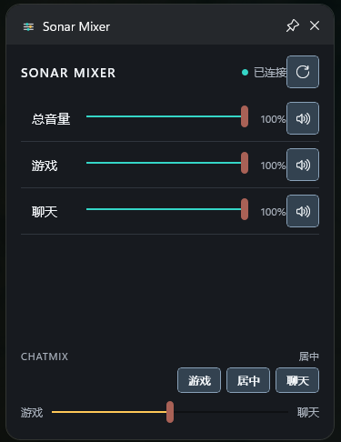

# SonarGameBar

简体中文 | [English](README.en.md)

SonarGameBar 是一个 Xbox Game Bar 小组件，方便在 `Win+G` 里调节 赛睿Sonar 的混音和音量，比如游戏和人声的混合比例。




## 使用

安装调试包后：

1. 启动 SteelSeries GG，并确认 Sonar 已启用。
2. 按 `Win+G` 打开 Xbox Game Bar。
3. 打开“小组件菜单”，选择 **Sonar Mixer**。

也可以手动打开小组件：

```powershell
Start-Process 'ms-gamebar://launch/activate/SonarGameBar.Widget_dybzwrprnmrze_App_SonarMixer'
```

## 构建

开发环境：

- Windows 10/11 x64
- Visual Studio，包含 UWP 开发工具
- Windows SDK `10.0.26100.0`
- .NET 8 SDK
- Xbox Game Bar
- SteelSeries GG 与 Sonar

构建并签名本地调试包：

```powershell
.\tools\Build-Debug.ps1
```

构建经过优化并使用测试证书签名的 Release 包：

```powershell
.\tools\Build-Release.ps1
```

推送提交或创建 Pull Request 后，GitHub Actions 会自动执行发布审计、测试和
完整 Widget 构建。构建成功后，可从对应 Actions 运行页面下载
`SonarGameBar-debug-x64-<提交哈希>` 和 `SonarGameBar-release-x64-<提交哈希>`。
两套构建产物都包含已签名的 MSIX、依赖包和测试证书。

安装调试包需要一次管理员 UAC，用于信任本地测试发布者证书：

```powershell
Start-Process powershell.exe -Verb RunAs -ArgumentList '-ExecutionPolicy Bypass -File ".\tools\Install-Debug.ps1"'
```

卸载调试包并移除测试证书：

```powershell
Start-Process powershell.exe -Verb RunAs -ArgumentList '-ExecutionPolicy Bypass -File ".\tools\Uninstall-Debug.ps1"'
```

详细开发说明见 [docs/DEVELOPMENT.md](docs/DEVELOPMENT.md)。

## 项目结构

```text
SonarGameBar.Core/     Sonar 地址发现、状态解析和控制 API
SonarGameBar.Bridge/   按需运行的桌面进程，连接 Widget 与 Sonar
SonarGameBar.Widget/   Xbox Game Bar UWP/XAML 小组件
tools/                 构建、安装、卸载和发布前审计脚本
docs/                  架构与开发文档
```

架构详情见 [docs/ARCHITECTURE.md](docs/ARCHITECTURE.md)。
