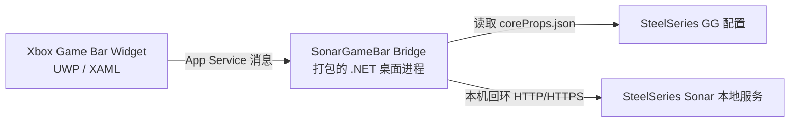

# 架构

## 总览



UWP 小组件负责用户界面。Bridge 是随包发布的 full-trust 桌面进程，只在小组件需要访问 Sonar 时按需启动。

## 项目

### SonarGameBar.Core

- 读取 SteelSeries GG 本地的 `coreProps.json`。
- 发现当前 GG 与 Sonar 服务地址。
- 拒绝非本机回环地址。
- 解析 classic 模式下的动态通道、音量与 ChatMix 状态。
- 发送经过校验的音量、静音和 ChatMix 更新。

### SonarGameBar.Bridge

- 承载小组件使用的 App Service 连接。
- 将轻量命令协议转换成 `SonarClient` 调用。
- 检测本机 Sonar 虚拟音频端点是否有音频活动，并把结果映射到通道状态。
- 提供命令行诊断模式。
- App Service 连接关闭后自动退出。

### SonarGameBar.Widget

- 注册 `SonarMixer` Xbox Game Bar 小组件。
- 通过 `FullTrustProcessLauncher` 启动 Bridge。
- 根据 Bridge 返回的动态通道列表渲染混音器状态。
- 对滑块更新做防抖，并在用户拖动时临时抑制轮询覆盖。
- 提供紧凑布局和 ChatMix 快捷操作。

## Bridge 协议

请求使用 `ValueSet` 消息：

```text
getState
setVolume(channel, value)
setMute(channel, value)
setChatMix(value)
```

当前写入目标会先根据 Sonar 响应中的动态通道列表校验。第一版兼容通道仍包括：

```text
master
game
chatRender
```

常见动态通道还包括：

```text
chatCapture
media
aux
```

## Sonar 集成

SteelSeries Sonar 暴露了一个未公开文档化的本地服务。GG 重启后服务地址可能变化，所以客户端会动态发现地址，并在连接失败后重新发现。

Sonar 集成被刻意隔离在 `SonarGameBar.Core` 中，因为不同 GG 版本可能改变接口路径或响应结构。

## 活跃音轨检测

Bridge 会枚举本机 Windows 音频端点，读取 Sonar 虚拟设备的峰值电平，并将有活动的端点映射到对应 Sonar 通道。检测只在本机完成，不上传进程名、会话信息或音频数据。

如果检测失败，小组件仍会正常显示和控制混音器，只是不显示活跃标记。
