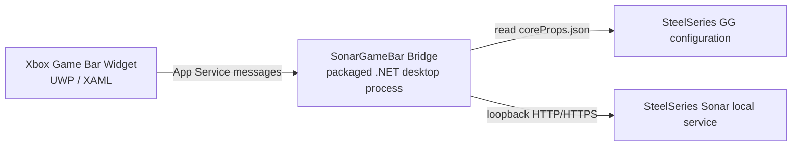

# Architecture

## Overview



The UWP widget owns the user interface. The Bridge is a packaged full-trust desktop process that is launched only when the widget needs it.

## Projects

### SonarGameBar.Core

- Reads SteelSeries GG's local `coreProps.json`.
- Discovers the current GG and Sonar server addresses.
- Rejects non-loopback addresses.
- Parses classic-mode volume and ChatMix state.
- Sends validated volume, mute, and ChatMix updates.

### SonarGameBar.Bridge

- Hosts the App Service connection used by the widget.
- Translates a small command protocol into `SonarClient` calls.
- Provides a command-line diagnostics mode.
- Exits after the App Service connection closes.

### SonarGameBar.Widget

- Registers the `SonarMixer` Xbox Game Bar widget.
- Launches the Bridge with `FullTrustProcessLauncher`.
- Polls visible mixer state.
- Debounces slider updates and temporarily suppresses polling while the user adjusts a value.

## Bridge protocol

Requests are `ValueSet` messages:

```text
getState
setVolume(channel, value)
setMute(channel, value)
setChatMix(value)
```

Supported first-version channels:

```text
master
game
chatRender
```

## Sonar integration

SteelSeries Sonar exposes an undocumented local service. Its address can change when GG restarts, so the client discovers it dynamically and retries after connection failures.

The integration is intentionally isolated in `SonarGameBar.Core` because endpoint paths and response shapes may change between GG releases.
